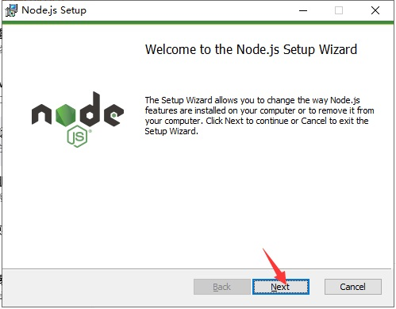
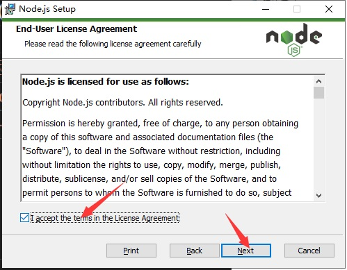
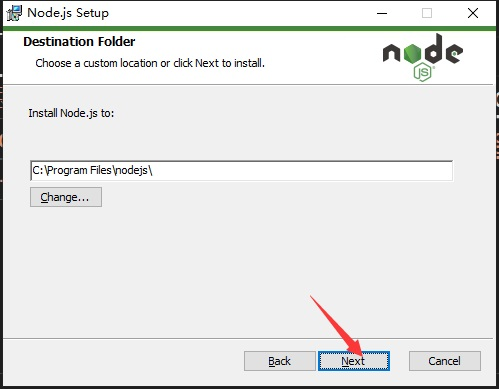
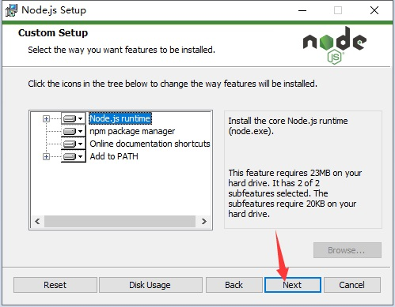
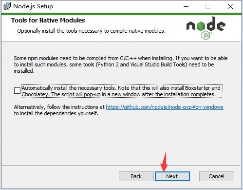
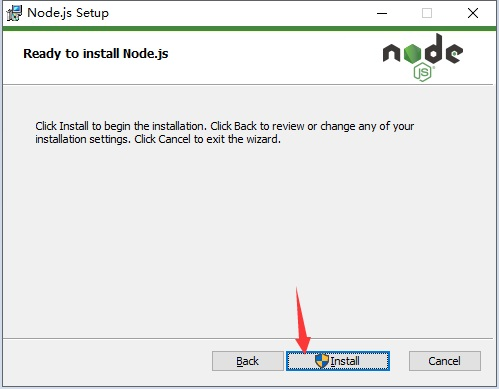
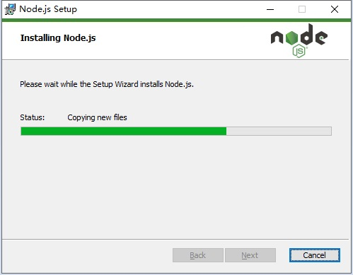
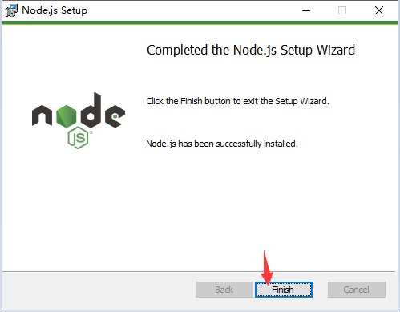

# 前端基础

## 软件安装和配置

- 检查软件安装版本
  - 执行`node -v`检查 nodejs 是否安装成功，当前项目使用 v10 版本
  - 执行`cnpm -v`检查 cnpm 是否安装成功（需要 node 安装成功之后）
  - 执行`gulp -v`检查 gulp 是否安装成功（需要 node 安装成功之后），当前使用 v3.9.1
- 安装软件
  - [nodejs 官方网站](http://nodejs.org/)
    - [nodejs v10 下载地址](https://nodejs.org/dist/v10.13.0/node-v10.13.0-x64.msi)
    - 安装图示  
        
        
        
        
        
        
        
      
  - [nodejs 淘宝源官方网站](http://npm.taobao.org/)
    - 执行`npm config set registry https://registry.npm.taobao.org`设置淘宝源
    - 执行`npm -g install cnpm`安装 cnpm
  - [gulp 官方网站](https://gulpjs.com/)
    - 执行`cnpm -g install gulp`全局安装 gulp 客户端

## 项目配置和初始化

- 执行`cnpm init`初始化项目 npm
  - 1:package name(目录名称):输入项目名称，回车默认就是目录名称
  - 2:version(1.0.0):输入项目版本号
  - 3:description:输入项目描述
  - 4:entry point(index.js):入口 js
  - 5:test command:测试命令
  - 6:git repository:git 的地址
  - 7:keywords:关键字
  - 8:author:作者
  - 9:license:(ISC):版权协议
  - 10:Is this OK?(yes):确认完成
  - 执行完成项目里面会出现 package.json，可以直接修改该文件
- 安装 jquery 和 bootstrap3
  - 执行`cnpm --save install jquery`安装 jquery
  - 安装成功，`package.json`中`dependencies`小节中会出现 jquery 版本号，项目`node_modules`目录中也会出现 jquery
  - 执行`cnpm --save install bootstrap3`安装 bootstrap3
  - 安装成功，`package.json`中`dependencies`小节中会出现 bootstrap 版本号，项目`node_modules`目录中也会出现 bootstrap3
- 配置 js 提示
  - 在项目根目录创建[jsconfig.json](jsconfig.json)文件
  - `exclude`小节是配置忽略的文件或者目录的列表，一定要将`node_modules`目录排除，该目录是nodejs插件目录，也不要将该目录添加到git中
  - `typeAcquisition`小节是配置要js提示的api列表

- vscode插件安装
  - Chinese(Simplified) Language Pack for Visual Studio Code （简体中文语言包）
  - Bracket Pair Colorizer (括号着色配对插件)
  - HTML CSS Support （html文件中css类名称支持插件）
  - Markdown All in One （markdown(md)文件编辑预览插件）
  - markdownlint （markdown文件语法检查插件）
  - nginx.conf （nginx配置文件插件）
  - nginx-formatter （nginx格式化插件）
  - open in browser （在浏览器中打开插件）
  - Prettier - Code formatter （代码格式化插件）
  - VSCode Great Icons （一套vscode图标库，在文件图标主题中使用）